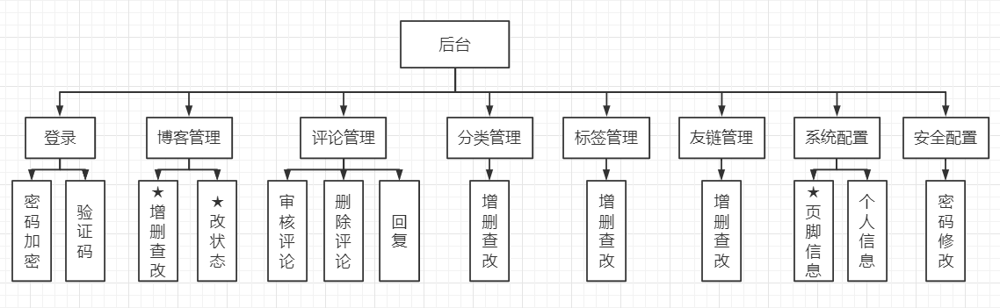
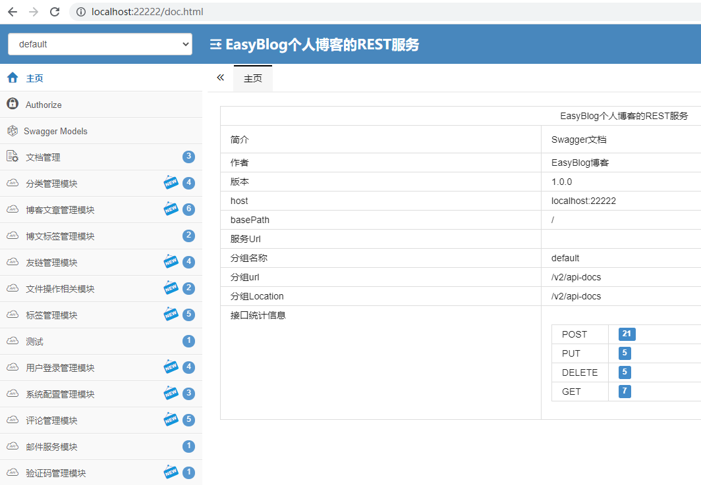
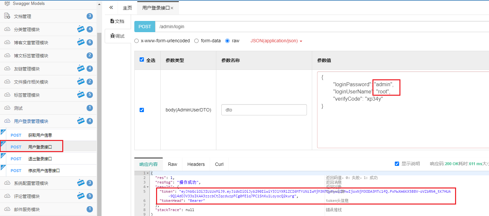
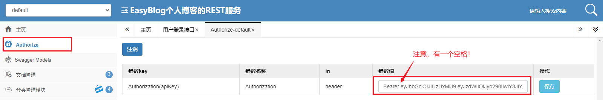
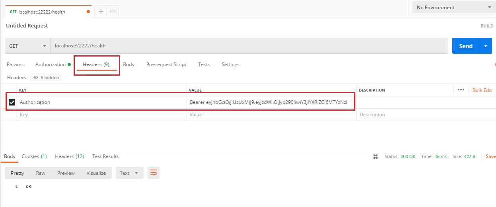

# easy_blog个人博客（后台）

## 前言

这是一个我自制的开源博客小项目，虽然技术上没有什么亮点，但是功能齐全，能满足基本的使用，计划部署到云服务器上。

另外，这个博客采用的架构是前后端分离，前端部分在另一个小伙伴那里（其实并不是因为我不会写Vue【x】），待更新完后再指出前端项目的地址。

这个项目会一直维护噢，虽然没什么人看，但是自己在用，也要把它做得顺手！

## 使用技术

+ 语言：Java
+ 开发框架：Spring Boot, Mybatis Plus
+ 安全相关：JWT, Jasypt, Spring Security
+ 验证码：Kaptcha 
+ 数据库版本管理：Flyway
+ 文档管理：Swagger
+ 项目版本管理：Git

PS：可以看出，其实这个项目真没什么东西，主要就是Spring Boot + Mybatis (Plus)，利用他们进行一些CRUD的开发。另外还尝试加入一些其它的小功能，比如做验证码校验，还有配置文件的加密等。另外我还想吐槽一下自己，使用了Jasypt对配置文件的密码进行加密，其实没啥用……还是“不安全”，后面再说。

## 功能模块图

在开发初期，简单地画了一个模块图，看一看就知道它大概有什么功能了。

## 运行
1. 检查

这个项目是基于Java11版本来写的，但是我没有使用有关11的新特性，应该（？）使用8也是可以的。
还需要MySQL8.0以上的版本。

2. 克隆到本地

我开发的时候使用的是IDEA2021，IDE之间差别应该不大，用eclipse也可以的。

3. 修改配置文件中的数据库配置

在yml中，与密码相关部分写的都是ENC(XXXX)，其中的XXXX正是Jasypt利用密钥jasypt.encryptor.password进行加盐加密。
你可以直接把它去掉，改成自己的数据库密码，因它的原理是识别以"ECN("开头，以")"结尾的串，进行自动解密；若没有，则正常读取配置。
可以在PasswordTest体验一下。

另外，你也需要保证有一个名为easy_blog的数据库表（或者把它改成你喜欢的名字），这里有flyway，会自动创建数据库表的。

4. 点击运行

等它运行完，然后运行localhost:22222/doc.html即可看到后台的接口。因为前端还没接上，所以现在没有页面可以观看。

## 注意的点

1. 登录账户

    下载到本地后，默认用户如下：
    账号：root
    密码：admin

1. Spring Security

    这个项目虽然接入的Spring Security，但是我并不熟悉它，只是跟着视频敲代码，所以这块可能实现了一些功能，但是我却不会改，并且有可能出现一些奇奇怪怪的意外，在此作提醒……

2. JWT
    
    这个项目还使用了JWT进行认证，除了被放行的接口外，请求其它接口都要在请求头的Authorization上加入JWT串。
    具体的演示如下：
        
    1. 请求localhost:22222/kaptcha获取验证码
    2. 请求登录接口
        
        
    3. 把tokenHead和token拼接起来，中间间隔一个空格，这个串就是请求别的接口时需要带上的串。
    4. 对于swagger，可以粘贴到Authorize中，以后请求都会自动帮你带上，方便开发。
        
        
    5. 用Postman也是一样的
    
        

## 后记

有啥问题可以提出来噢，也可以邮件联系：tanjiaming99@163.com 

